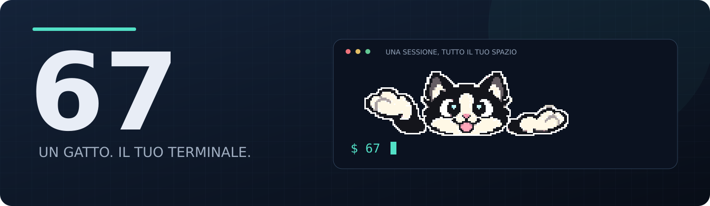
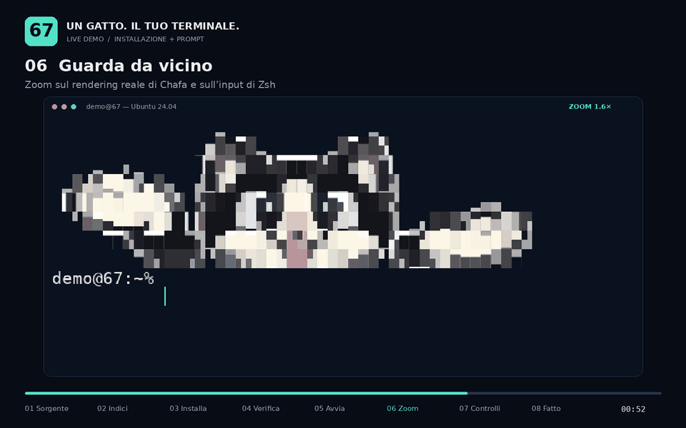

<p align="center">
  
</p>

<p align="center">
  <strong>67.</strong><br>
  Un piccolo gatto che ti fà il 67.
</p>

<p align="center"> 
  <a href="#installazione">Installa</a> ·
  <a href="#utilizzo">Usalo</a> ·
  <a href="#sviluppo-e-verifiche">Sviluppa</a> ·
  <a href="LICENSE">MIT</a>
</p>

<p align="center">
  
  
  
  
</p>

## Cosa fa

Digita `67`: un gatto nero e bianco alterna le zampe nel gesto “6 7”, mentre tu continui a usare il terminale. L'animazione sta **sopra il prompt**; l'input ha la propria riga e i comandi producono il loro normale output.

- **Animazione nel terminale.** Chafa converte la GIF in caratteri Unicode e colori; Zsh li integra nel proprio editor.
- **Input utilizzabile.** Frecce, cancellazione, cronologia della sessione, comandi lunghi e input multilinea restano disponibili.
- **Sessione temporanea.** Parte nella directory corrente; `exit` ti riporta alla shell da cui sei partito. I tuoi dotfile e la shell predefinita restano intatti.
- **Controlli immediati.** `67 --stop` nasconde il gatto, `67` lo riattiva. Ctrl+C annulla l'input e ferma l'animazione.
- **Runtime piccolo.** Chafa, Zsh e le normali utilità di sistema. Per usarlo non servono Python, Docker o tmux.

Lo sprite è un asset di **144 × 48 pixel**, con due pose da 280 ms. Nel terminale occupa **48 colonne × 8 righe**: una dimensione scelta per distinguere occhi, lingua e zampe. [Guarda il confronto visivo](design/README.md).

<a href="https://dev-seq-67.github.io/67/demo/">
  
</a>

## Installazione

### Debian / Ubuntu: repository APT

Al primo utilizzo aggiungi la sorgente APT del progetto. Esegui questi comandi **nell'ordine indicato**; l'ultimo avvia il programma:

```sh
curl -fsSL https://dev-seq-67.github.io/67/configure-apt.sh -o /tmp/67-configure-apt.sh
sudo sh /tmp/67-configure-apt.sh https://dev-seq-67.github.io/67
sudo apt update
sudo apt install 67
67
```

I primi due comandi preparano `curl` e i certificati HTTPS per scaricare lo script. Se sono già installati, APT li lascia invariati. Lo script configura il repository e verifica l'hash della chiave pubblica. Il secondo `apt update` aggiorna gli indici includendo il repository di 67; `apt install 67` installa il programma e le dipendenze Chafa e Zsh. L'ultimo comando, `67`, lo avvia in un terminale interattivo.

La configurazione del repository si fa **una sola volta per computer**. In seguito, per installare o aggiornare il pacchetto, bastano:

```sh
sudo apt update
sudo apt install 67
```

Il pacchetto non è nei repository ufficiali di Debian o Ubuntu: il computer deve prima conoscere la sorgente di 67. Lo script aggiunge questi due file:

| File | Scopo |
| --- | --- |
| `/etc/apt/keyrings/67-archive-keyring.gpg` | Chiave pubblica per verificare questa sorgente. |
| `/etc/apt/sources.list.d/67.sources` | Indirizzo del repository e riferimento alla chiave tramite `Signed-By`. |

**Verifica facoltativa:**

```sh
command -v 67
dpkg-query -W 67 chafa zsh
67 --help
```

[Dettagli sulla sorgente, sulle firme e sulla pubblicazione](docs/apt-repository.md).

### Prova senza installare il progetto

Con Git, Chafa e Zsh disponibili:

```sh
git clone https://github.com/Dev-Seq-67/67.git
cd 67
./src/67
```

Su Debian/Ubuntu puoi ottenere gli strumenti con `sudo apt install git chafa zsh`. Esegui il launcher in un terminale interattivo; `exit` chiude la sessione di prova.

### Installazione dai sorgenti

Dalla copia del repository:

```sh
sudo apt install chafa zsh
sudo ./install.sh
67
```

Lo script installa il launcher in `/usr/local/bin/67`, la GIF e `prompt.zsh` in `/usr/local/share/67/`, e i quattro moduli in `/usr/local/share/67/prompt/`. `/usr/local/bin` deve essere nel `PATH`.

### Pacchetto `.deb` costruito localmente

Dalla copia del repository, con `dpkg-deb` disponibile:

```sh
./packaging/build-deb.sh
sudo apt install ./dist/67_1.5.0_all.deb
67
```

Il pacchetto è `Architecture: all`: contiene script e asset, mentre le dipendenze native arrivano dalla distribuzione. Il builder legge la versione da [`packaging/control`](packaging/control).

**Scegli un metodo di installazione.** Una copia in `/usr/local/bin` può avere precedenza su quella gestita da APT in `/usr/bin`. Usa `command -v 67` per sapere quale stai avviando.

## Requisiti

| Componente | Requisito |
| --- | --- |
| Sistema | Linux; pacchetto e istruzioni APT per Debian/Ubuntu. Demo verificata su Ubuntu 24.04. |
| Chafa | **≥ 1.12.0**, per convertire la GIF in fotogrammi da terminale. |
| Zsh | **≥ 5.8**, per la sessione privata e l'editor interattivo. |
| Terminale | Input e output interattivi, UTF-8; supporto ai colori RGB consigliato. |
| Spazio | Almeno **48 colonne × 10 righe** per mostrare la GIF. Una finestra da 80 × 24 lascia più spazio ai comandi. |
| Configurazione APT | `curl`, certificati HTTPS e accesso amministrativo. Servono per installare, non per ogni avvio. |

Per lo sviluppo, i test usano anche `tmux` e Perl. Gli strumenti per produrre il video hanno dipendenze proprie, descritte [qui](tools/demo/README.md).

## Utilizzo

Avvia da qualsiasi directory:

```sh
67
```

Si apre una **nuova sessione Zsh temporanea** nella directory corrente. La shell eredita ambiente e `PATH`; usa la configurazione privata del progetto, senza caricare la tua `.zshrc` personale. Alias, temi e plugin definiti in quel file non saranno presenti.

Puoi scrivere comandi normalmente:

```sh
pwd
printf 'Il prompt funziona.\n'
```

Mentre digiti, il gatto continua ad animarsi sopra l'input. Quando premi Invio lascia spazio al comando e al suo output; al prompt successivo ricompare. I caratteri dello sprite sono separati dall'input eseguito.

### Comandi e tasti

| Comando / tasto | Effetto |
| --- | --- |
| `67` dalla tua shell | Apre la sessione temporanea con l'animazione attiva. |
| `67` dentro la sessione | Riattiva l'animazione senza aprire un'altra sessione. |
| `67 --stop` dentro la sessione | Nasconde la GIF; puoi continuare a usare la shell. |
| `67 --help` oppure `67 -h` | Mostra l'aiuto. |
| **Ctrl+C** mentre digiti | Annulla la riga e nasconde la GIF. Digita `67` per riattivarla. |
| **Ctrl+C** durante un comando | Interrompe il comando; l'animazione resta nascosta fino a `67`. |
| `exit` | Chiude la sessione privata e torna alla shell originale. |

`67 --stop` va eseguito **nella sessione con il gatto**. Da un'altra shell non controlla una sessione già aperta.

La cronologia della sessione rimane in memoria. L'animazione non crea pannelli tmux e non richiede di cambiare la shell predefinita. Il renderer viene chiuso all'uscita; i tuoi processi in background non sono bersagli della pulizia del renderer.

### Finestre piccole e ridimensionamento

Sotto 48 colonne o 10 righe la GIF viene nascosta e il renderer si ferma. L'input rimane disponibile. Allargando la finestra il programma tenta di ripristinare l'animazione.

**Limite noto:** dopo una sequenza di restringimento e riallargamento alcune righe del gatto possono finire fuori dalla parte visibile del terminale. La suite delle risorse rileva ancora questo problema. Per recuperare una visualizzazione pulita, esci con `exit` e avvia nuovamente `67` in una finestra sufficientemente ampia. [Evidenze e stato dei test](tests/results/README.md).

## Aggiornamento e rimozione

### Aggiornare tramite APT

Con la sorgente già configurata:

```sh
sudo apt update
sudo apt install --only-upgrade 67
```

Gli aggiornamenti del pacchetto rientrano anche nei normali aggiornamenti di sistema. La disponibilità di una nuova versione dipende dalla pubblicazione di un nuovo pacchetto firmato.

### Disinstallare

Esci prima dalla sessione con `exit`. Per il pacchetto APT o `.deb`:

```sh
sudo apt purge 67
```

Se vuoi rimuovere anche la sorgente del progetto:

```sh
sudo rm -f /etc/apt/sources.list.d/67.sources /etc/apt/keyrings/67-archive-keyring.gpg
sudo apt update
```

Per una copia installata tramite `install.sh`, dalla directory del repository:

```sh
sudo ./uninstall.sh
```

Chafa e Zsh possono essere usati da altri programmi: la rimozione di `67` non richiede di disinstallarli manualmente.

## Se qualcosa non funziona

| Sintomo | Cosa controllare |
| --- | --- |
| `Unable to locate package 67` / pacchetto non trovato | Completa la configurazione iniziale della sorgente e controlla che `sudo apt update` termini senza errori per il repository di 67. |
| Errore di firma o chiave APT | Riesegui lo script di configurazione usando l'URL di questa guida, poi `sudo apt update`. Se persiste, conserva il messaggio completo e [apri una segnalazione](https://github.com/Dev-Seq-67/67/issues). |
| `67: command not found` | Verifica l'installazione e il `PATH`. Per lo script locale deve esserci `/usr/local/bin`; per APT il comando è in `/usr/bin`. |
| `67: manca chafa` / `manca zsh` | Installa `chafa` e `zsh`; per lo script locale le dipendenze vanno installate separatamente. |
| `avvia il comando in un terminale interattivo` | Esegui `67` direttamente nel terminale, senza pipe o redirezioni. |
| `asset mancanti` / `moduli mancanti` | Reinstalla usando lo stesso metodo. Il launcher ha bisogno della GIF, di `prompt.zsh` e dei quattro moduli. |
| Nessun gatto dopo Ctrl+C | Digita `67` nella sessione: Ctrl+C disattiva intenzionalmente l'animazione. |
| Gatto assente o tagliato dopo un resize | Controlla le dimensioni; per il limite noto, esci e riavvia in una finestra ampia. |
| Colori o caratteri insoliti | Usa un terminale UTF-8 con un font che copra i caratteri a blocchi Unicode e supporto RGB. |
| Alias o tema personale assenti | È la sessione privata del progetto: non carica la tua `.zshrc`. `exit` torna al tuo ambiente abituale. |

Per una segnalazione utile indica distribuzione, terminale, dimensioni della finestra, metodo di installazione e output di `chafa --version` e `zsh --version`. Aggiungi uno screenshot se il difetto è visivo.

## Come funziona

```text
67 → sessione Zsh privata → Chafa legge la GIF
                           ↓
                   decodifica ANSI e cache
                           ↓
                 animazione sopra il prompt
                 input nella riga successiva
```

Il launcher POSIX trova gli asset relativamente al proprio percorso, crea un `ZDOTDIR` temporaneo e avvia Zsh. Nell'editor, **`PREDISPLAY` contiene lo sprite e il prompt; `BUFFER` contiene soltanto ciò che scrivi**. Le evidenziazioni vengono rimosse prima di accettare un comando, per evitare che i colori della GIF passino all'input.

Chafa usa un thread e la modalità di lavoro economica. La cache mantiene al massimo 32 fotogrammi decodificati. Il renderer si arresta quando l'animazione è disabilitata, non entra nella finestra o la sessione termina. [Architettura e vincoli di manutenzione](docs/architecture.md).

### Mappa del repository

| Percorso | Contenuto |
| --- | --- |
| [`src/67`](src/67) | Launcher POSIX: argomenti, dipendenze, percorsi e sessione privata. |
| [`src/prompt.zsh`](src/prompt.zsh) | Configurazione Zsh e caricamento dei moduli. |
| [`src/prompt/`](src/prompt/) | `ansi.zsh`: colori; `frames.zsh`: cache; `renderer.zsh`: Chafa; `editor.zsh`: input e lifecycle. |
| [`assets/67.gif`](assets/67.gif) | Animazione distribuita. |
| [`design/`](design/) | Sorgenti grafici, confronti e anteprime. |
| [`install.sh`](install.sh) / [`uninstall.sh`](uninstall.sh) | Installazione locale e staging con `DESTDIR`. |
| [`packaging/`](packaging/) | Metadati Debian, builder `.deb` e strumenti per firmare il repository. |
| [`apt/`](apt/) | Snapshot pubblico del repository APT firmato. |
| [`tests/`](tests/) | Test interattivi, controlli APT e risultati delle misure. |
| [`docs/demo/`](docs/demo/) | Video, anteprima, player e catture originali. |
| [`tools/demo/`](tools/demo/) | Ambiente e script per riprodurre la registrazione. |

## Sviluppo e verifiche

### Controlli di sintassi

```sh
for file in src/67 install.sh uninstall.sh packaging/build-deb.sh packaging/apt/*.sh tests/*.sh; do
    sh -n "$file" || break
done
for file in src/prompt.zsh src/prompt/*.zsh; do
    zsh -n "$file" || break
done
```

### Test interattivi

Con tmux, Perl, Chafa e Zsh disponibili:

```sh
./tests/regression.sh
./tests/integration.sh
./tests/resources.sh
```

La regressione verifica anche una copia deliberatamente difettosa: il controllo deve rilevare i colori dello sprite che contaminano un comando accettato. L'integrazione copre animazione, digitazione, righe lunghe, Unicode, multilinea, Ctrl+C, job control e pulizia all'uscita.

**La suite completa delle risorse non passa ancora**, per il problema di resize descritto sopra. Le misure locali documentate riportano circa **3,6% di un core**, **20 MiB di RSS complessiva** e **due processi / due thread** durante l'animazione. Sono osservazioni su una macchina e una configurazione specifiche, non limiti garantiti su ogni sistema. [Metodo dei test](tests/README.md) · [Risultati e condizioni](tests/results/README.md) · [Verifiche del refactor](tests/results/refactor.md).

### Installazione di prova senza toccare il sistema

```sh
stage=$(mktemp -d)
DESTDIR="$stage" ./install.sh
(cd /tmp && PATH="$stage/usr/local/bin:$PATH" 67)
# Nella sessione temporanea: prova i comandi, poi digita exit.
DESTDIR="$stage" ./uninstall.sh
```

### Pubblicare un aggiornamento APT

I manutentori aggiornano la versione in `packaging/control` e gli esempi della guida, poi eseguono:

```sh
./packaging/apt/init-key.sh
./packaging/apt/prepare-publication.sh
```

La preparazione costruisce il pacchetto, firma gli indici e li verifica con APT isolato, inclusi i controlli sui file alterati. La chiave privata resta fuori dal repository. Il workflow Pages pubblica lo snapshot già firmato e la pagina della demo; una modifica ai soli sorgenti non genera automaticamente un nuovo pacchetto.

[Guida per i manutentori](docs/apt-repository.md) · [Istruzioni di progetto](AGENTS.md).

## Contributi e licenza

Segnala problemi e proponi miglioramenti nelle [issue](https://github.com/Dev-Seq-67/67/issues) o con una pull request. Per modifiche visive includi una cattura del terminale; per modifiche all'input e al renderer conserva la separazione tra sprite e comandi, i processi in background dell'utente e la pulizia della sessione.

**67 è distribuito con licenza [MIT](LICENSE).** Il progetto usa [Chafa](https://hpjansson.org/chafa/) per il rendering e [Zsh](https://www.zsh.org/) per l'interazione.
